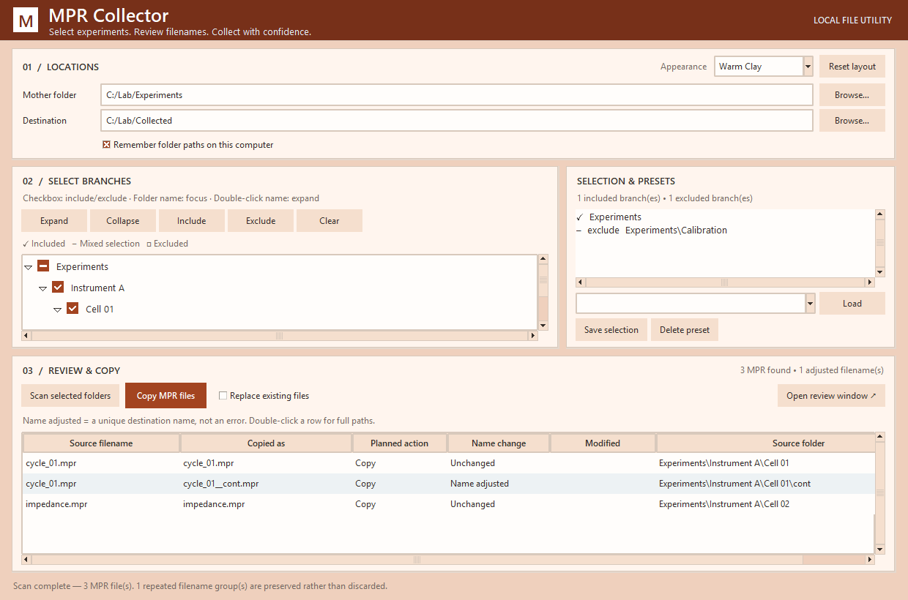

# MPR Collector

A lightweight Windows desktop tool for collecting BioLogic `.mpr` files from experiment branches into one flat destination folder. Source files are copied, never moved, renamed, or deleted. No accounts, telemetry, network requests, or third-party Python packages.



## Start here

1. Download and **extract the whole ZIP** into a writable folder. Keep the four Python files and launcher together.
2. If needed, install **Python 3.10 or newer with Tkinter** from [Python for Windows](https://www.python.org/downloads/windows/). Use the normal Windows installer with Tcl/Tk enabled. You do not need to learn Python or install pip packages.
3. Double-click **Run_MPR_Collector.bat**. If Python is missing, it explains what to install.
4. Choose a **Mother folder** and a **Destination**. A destination outside your source tree is easiest to maintain.
5. Click a folder checkbox to include or exclude its subtree. Clicking the folder name only focuses it; double-clicking the name expands or collapses it. You can include a deeper branch again. The mother folder itself can also be selected.
6. Click **Scan selected folders**, review **Source filename**, **Copied as**, and **Planned action**, then **Copy MPR files** and confirm the summary.

Only `.mpr` extensions are collected, regardless of capitalization. Contents are copied as bytes; the tool does not interpret or validate BioLogic data.

## Adjust the workspace

- Drag the divider between folders and selection to change panel widths.
- Drag the divider above Review & Copy to change panel heights.
- Resize the window and drag table-column boundaries. Window dimensions, panel proportions, column widths, maximized state, and appearance are remembered.
- **Reset layout** restores the default arrangement.
- Eleven distinct color schemes include **Dark Red**, **Dark Blue**, **Dark Teal**, and **Dark Violet**, plus stronger light themes. **Lab Slate** remains the default. Existing saved themes still load.
- Long paths and filenames have horizontal scrollbars; lists also scroll vertically.
- **Include**, **Exclude**, and **Space** act on the focused folder. Expand/Collapse buttons and Left/Right keys control expansion.

Scans and copies run in the background with an activity indicator. Selection and action controls are temporarily disabled to keep each operation consistent. Wait for completion before closing. Very large result tables can take a moment to display.

## Review in detail

- **Open review window** opens a separate resizable window that can be maximized or left open while using the main app. Closing it leaves the main view and any active copy operation intact.
- Search and click column headings to sort in the separate window. Its filtering, sorting, and column widths do not change the main table or the scan selection. **Copy all scanned files** always uses the entire scan, even when the window is filtered, and asks for confirmation.
- Double-click a column divider to fit the longest displayed value. Width is limited to 520 pixels or half the table width, whichever is smaller, so a long path cannot take over the table. Drag the divider manually for a different width.
- Double-click a row or press Enter for full source and destination paths. File details show a snapshot taken when opened.
- **Name adjusted** means the destination name was made unique (for example, a continuation suffix or duplicate filename). It is not an error. The **Name change** column explains this explicitly; alternating row shades only aid reading.

## Presets

**Save selection** stores the mother folder and inclusion/exclusion rules. **Load** restores them. **Delete preset** removes the selected preset after confirmation. Older presets containing lists of included folders still load. Missing preset folders are reported.

## Duplicate names and continuations

The destination stays flat. Typical copied names:

```text
Cell 12/sample.mpr       -> sample.mpr
Cell 12/cont/sample.mpr  -> sample__cont.mpr
Cell 12/cont2/sample.mpr -> sample__cont2.mpr
```

Real source filenames are reserved before generated names: an existing source called `sample__cont.mpr` cannot be silently replaced by a generated name. Numeric suffixes resolve remaining collisions. Continuation folders retain their suffix even when scanned alone.

Names are deterministic for the same selection. Changing the selection can change the suffix needed to distinguish conflicting sources. Always review the table before updating an old destination. Existing destination files are matched by **name**, not content or source identity.

## Copy safety

- Existing destination names are **skipped by default**. Enable **Replace existing files** only to replace those individual files. Unrelated destination files remain in place.
- Each file is staged beside the destination before publication. An ordinary copy failure preserves the previous destination file. Completed files from the same batch remain copied; this is not an all-or-nothing batch transaction.
- Targets that are selected source paths or symbolic links are refused. Invalid names and duplicate targets in a custom plan are rejected before copying.
- Inaccessible selected folders produce a scan error instead of a misleading complete result.
- Copy completed experiments. The app does not lock instrument files that are still changing, verify hashes, or replace backups. Power loss can leave a `.mpr-copy-*.tmp` file; durability depends on the filesystem.

## Privacy and sharing

Settings and presets are plain-text JSON beside the program in `MPR_Collector_Data/`.

- Uncheck **Remember folder paths on this computer** to clear remembered source/destination paths from settings. Appearance and layout still save; current session paths remain available.
- **Saved presets still contain folder paths**, independently of the checkbox. Share them only if those paths are appropriate to disclose.
- Share a clean repository download or distribution ZIP, rather than zipping your working installation. Leave out settings, presets, and experiment data. Check screenshots for private paths.
- OneDrive or another service may sync files if you keep the program or destination in a synced folder. MPR Collector itself makes no network requests.
- Generated filenames can contain experiment-folder names. Check names before sharing collected data.

The included `.gitignore` excludes private portable data, mixed-case `.mpr` files, related exports, and common credentials/cache files. **Ignore rules do not protect ZIP archives, manual browser uploads, forced additions, or files already committed.** Review what you share. See [GitHub's explanation of ignored files](https://docs.github.com/en/get-started/git-basics/ignoring-files).

## Troubleshooting

- **Python missing:** follow the launcher message and install Python with Tcl/Tk.
- **Settings not retained:** use a writable program folder and check Remember paths.
- **No files found:** check selection, exclusions, and `.mpr` extensions.
- **Copy fails:** check free space, permissions, locked files, and Windows path length. Read the errors; successful copies remain available.
- **Destination inside the source tree:** later scans can include its copies. Prefer a separate destination or explicitly exclude that branch.

## Development

From the project directory:

```console
python -m unittest discover -s tests -v
```

Tests use temporary synthetic files and cover recursive selection, exclusions, continuations, global filename collisions, copy failure safety, privacy settings, saved layout, keyboard selection, the UI scan/copy workflow, checkbox interactions, independent review windows, capped column fitting, and dark appearance. UI tests require Tkinter and a desktop session. The suite was verified locally on Windows with Python 3.12. No pip dependencies are needed.
